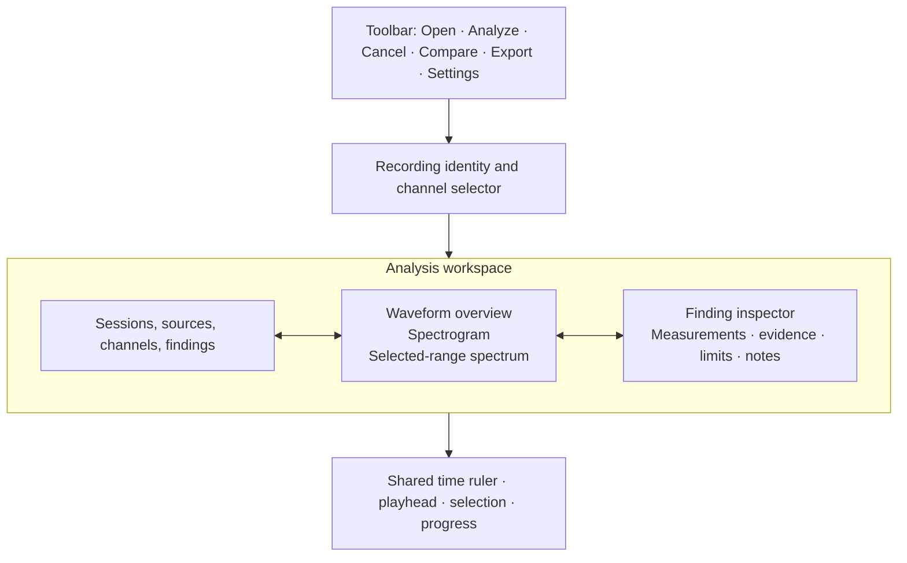

# HumTrace desktop GUI and visual design specification

**Status:** product and visual specification. Framework recommendation is in [GUI toolkit research](../research/gui-toolkit-evaluation.md) and the current decision report at [GUI toolkit decision research](../research/gui-toolkit-decision-research.md). The framework-independent app contracts below remain valid if the toolkit changes.

## Product role and interaction principles

HumTrace is an analytical workbench for inspecting recorded audio. It is not a live meter, audio editor, cleanup tool, source-attribution engine, or evidence-custody system. The interface should make the measured waveform, method, and limitations easy to inspect while keeping analysis controls out of the visual data path.

- Show observations first, candidate interpretations second, limitations beside both.
- Keep original channels separate. Visibility toggles never change analysis inputs.
- Analysis and display settings are distinct. Zoom/pan/cursor changes do not rerun or change DSP.
- Any derived operation (resample, downmix, alignment, filter, export redaction) is an explicit user action and appears in the session/report.
- Preserve user work across window resizing. Keep the analysis task cancellable and the window responsive.

## Visual direction

Use a restrained, instrument-like dark interface: dark blue/slate surfaces, fine neutral separators, compact but readable data typography, and bright accents reserved for measured traces, selected objects, and warnings. Avoid decorative gradients, glow, fake hardware meters, 3D knobs, and color effects that compete with low-level spectral detail. Charts should feel precise and quiet, with visible axes, units, and scale context.

Initial palette tokens, to be verified against WCAG contrast on implementation:

| Token | Suggested value | Use |
|---|---|---|
| `canvas` | `#111820` | Main application background |
| `surface` | `#19232D` | Panels, tables, toolbars |
| `raised` | `#222F3B` | Menus, selected cards, popovers |
| `text.primary` | `#F0F3F6` | Primary labels and values |
| `text.secondary` | `#A6B3C2` | Supporting labels, axis ticks |
| `accent.signal` | `#59D8E8` | Spectrum cursor/selected trace |
| `accent.event` | `#FFBF69` | Candidate event and caution |
| `accent.compare` | `#C4A7FF` | Comparison overlay |
| `status.ok` | `#7ED6A5` | Completion/verified state only |
| `status.error` | `#FF7773` | Error state |

Color is never the only encoding: pair trace colors with channel labels, solid/dashed patterns, markers, and table values. Text aims at WCAG 2.2 AA contrast (4.5:1 for normal text; 3:1 for large text). Chart/UI boundaries and focus indicators must remain distinguishable at 3:1 or better where the criterion applies. Include a high-contrast theme and test keyboard focus visibility. [1][2]

Using the WCAG relative-luminance formula, the proposed primary text has 16.04:1 contrast on `canvas` and 14.29:1 on `surface`; secondary text is 8.38:1 and 7.46:1 respectively. Accent values are also above 6:1 on both bases. These are palette-pair calculations only; text over plots, disabled states, overlays, selected rows, and focus states still need implementation-level checks.

## Main window layout

Target initial desktop size is 1440×900 logical pixels. Support minimum usable size 1024×680, 100–200% text/UI scaling, and panels that collapse without hiding essential actions. This is a design target, not a platform support claim.

Use a collapsible left rail (about 240 px), central chart workspace (flexible, minimum 520 px), and right inspector (about 340 px). When the window narrows, convert rails to drawers and preserve a visible channel selector, run/cancel state, selected measurement, and export action.

## Screens and components

### 1. Start and file-open state

Show a clear Open Recording action, supported formats, and a recent-session list. Drag-and-drop is an alternate entry, not the only entry. Do not show empty charts that resemble failed analysis. Recent file paths are local/private and can be cleared. Opening is read-only.

### 2. Recording header

Show basename, decode status, duration, sample rate, channel count/layout, sample format/valid bits, and original-file hash status when available. Warn if channel layout is unknown, source changed during analysis, the file is truncated, or decoding required a documented transformation.

### 3. Waveform overview

Render a min/max envelope pyramid to show the whole file without loading every sample into a GUI object. Show per-channel lanes by default. Selection range is draggable and keyboard adjustable. Tooltip reports time, sample index, peak/RMS only when those measurements are actually available. Waveform is context; it does not prove a click or artifact's cause.

### 4. Spectrogram

Use a time × frequency heatmap with logarithmic frequency scale as the default for hum/interference inspection and an explicit linear option. Display frequency/time axes, window/hop, amplitude/PSD mode, and color floor/ceiling. The scale must be labeled (e.g. dBFS/Hz for PSD), not an unexplained color map. Provide grayscale/accessible palette options. Render tiles at the current zoom and maintain a bounded cache.

### 5. Spectrum panel

Show selected channel and selected time interval, window, FFT length, bin spacing, and estimator. Cursor readout gives frequency, unit/value, raw bin, interpolated frequency when valid, and uncertainty/resolution context. Mark DC and Nyquist. Provide a table view equivalent to cursor exploration for keyboard and screen-reader users.

### 6. Findings list and event timeline

List measured event/track, start/end, duration, channel, median frequency, peak/RMS level, persistence coverage, and warnings. Sorting must not reorder source measurements. Selecting an event synchronizes its interval across all charts and the inspector. Use labels and line styles as well as color. Distinguish “observation”, “candidate pattern”, “user note”, and “warning”.

### 7. Finding inspector

Sections: summary; measurement and units; frame/track evidence; harmonic partial table; noise-floor method; settings; warnings; qualified interpretation; limitations; analyst notes. Show every threshold behind support counts. Possible physical mechanisms use “may be consistent with” wording and remain visually subordinate to measurements.

### 8. Comparison view

Place recordings side by side with matching axes only when units/ranges are compatible. Make unmatched durations obvious. Show alignment offset and resampling state in a persistent banner. Unmatched tracks remain explicit; do not turn absence into a zero-valued measurement.

### 9. Export preview

Show report schema/version, input digest, completion state, warnings, destination, and path-redaction choice. Existing report replacement requires explicit confirmation. Export does not alter source audio.

## Interaction and keyboard contract

Keyboard-only flow must support Open, channel selection, Analyze, Cancel, chart focus, zoom, pan, time selection, next/previous finding, inspector/table navigation, export, and help. Provide shortcuts in menus and help, avoid trapping focus, and keep focus visible. Every custom chart has a focusable accessible summary and an equivalent measurement/event table. Screen reader announcements are concise and throttled; do not announce every frame update.

Mouse and keyboard behaviors:

- Click/drag selects time; shift-click extends; escape clears selection; arrow keys move selection/playhead by a documented step.
- Wheel/trackpad zooms around the pointer; horizontal pan never changes analysis settings.
- Clicking a finding selects channel and time range; it does not switch to a mixed/downmixed signal.
- Settings changes mark the result stale and require explicit reanalysis; display-only settings never mark it stale.
- Cancel leaves the source unchanged and labels partial output as cancelled.

## State model and error presentation

States: `empty`, `opening`, `ready`, `queued`, `hashing`, `decoding`, `analyzing`, `finalizing`, `complete`, `cancelling`, `cancelled`, `failed`, `invalidated`. Show progress only when countable; otherwise show stage and current work. Errors identify file/stage and next action, preserve logs without dumping sensitive absolute paths into public reports, and never silently fall back to mono, resampling, or another decoder.

## Accessibility and platform validation

Check semantic names/roles/value for every control, keyboard traversal, visible focus, text resizing, contrast, color independence, high-contrast mode, and table alternatives. Test the actual packaged app with Windows Narrator and a Linux screen reader/AT-SPI environment. Toolkit-native widgets are preferred for controls; custom plots need their own accessible model and keyboard operations. Passing toolkit documentation is not proof of HumTrace accessibility. See [toolkit decision research](../research/gui-toolkit-decision-research.md).

## Architecture and performance boundary

The shell owns navigation, settings snapshots, worker lifecycle, and immutable result views. Analysis jobs run on a worker with bounded input/FFT buffers; chart rendering consumes decimated waveform summaries, spectrogram tiles, and event rows. UI must not call DSP per paint or retain full-resolution samples for the full duration. Keep toolkit types out of core headers. GUI tests cover state transitions and user-visible behavior; plot math stays in a testable presentation-model module.

## Acceptance criteria

- A user can load, analyze, inspect each channel independently, navigate a finding, understand its evidence/limits, and export a report without a mouse.
- A multi-hour file does not freeze the window; progress and cancellation work through decode, analysis, and finalization.
- Plot zoom and color changes never alter analysis results.
- Every plotted value has a text/table alternative and units.
- High-DPI, narrow-window, long filename, many-channel, no-findings, malformed-input, cancelled-job, and report-overwrite states are visually reviewed.
- No UI label asserts ground loop, device, source location, recording date, authenticity, or custody based only on a frequency pattern.

## Sources

1. W3C, [WCAG 2.2](https://www.w3.org/TR/WCAG22/), contrast and resize criteria.
2. W3C WAI, [Focus Not Obscured (Minimum)](https://www.w3.org/WAI/WCAG22/Understanding/focus-not-obscured-minimum) and [Non-text Contrast](https://www.w3.org/WAI/WCAG22/Understanding/non-text-contrast.html).
3. HumTrace [product requirements](product-requirements.md), [analysis engine](analysis-engine.md), [long-file workflow](long-file-workflow.md), and [report integrity](report-integrity.md).
